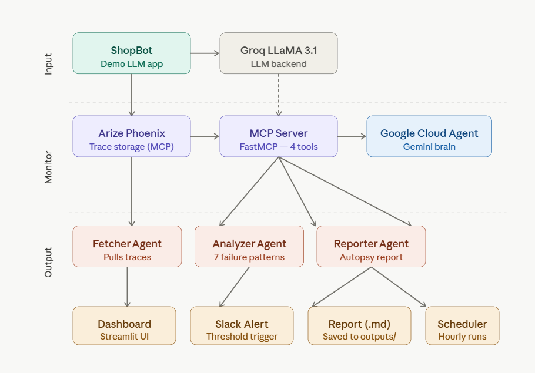

# 🔬 The AI Coroner

> An autonomous LLM diagnostic agent that detects, diagnoses, and fixes AI failures in real time.

**Live Demo:** https://the-ai-coroner.streamlit.app/

---

## What It Does

The AI Coroner monitors your LLM application, automatically detects when it starts failing, clusters the failures by root cause, and prescribes specific fixes all without human intervention.

Think of it as a doctor for your AI. When your LLM app gets sick, The AI Coroner performs an autopsy.

---

## How It Works

```
LLM App → Arize Phoenix (traces) → AI Coroner Agent → Autopsy Report + Slack Alert
```

1. **ShopBot** (demo LLM app) runs and logs every interaction to Arize Phoenix
2. **Fetcher Agent** pulls traces from Arize via MCP
3. **Analyzer Agent** clusters failures into 7 patterns
4. **Reporter Agent** generates a plain-English autopsy report
5. **Slack Alert** fires when failure rate exceeds threshold

---



---

## Failure Patterns Detected

- Gibberish Input
- Out of Scope
- Aggressive Input
- Impossible Request
- Hallucination Risk
- Toxic Output Risk
- Missing Information

---

## Tech Stack

| Component | Technology |
|---|---|
| Agent Brain | Gemini via Google Cloud Agent Builder |
| LLM Monitoring | Arize Phoenix (MCP) |
| Dummy App Model | Groq LLaMA 3.1 |
| Dashboard | Streamlit |
| Alerts | Slack Webhooks |
| MCP Server | FastMCP |

---


## Running Locally

### Prerequisites
- Python 3.12+
- uv package manager
- Arize Phoenix account
- Groq API key
- Slack webhook (optional)

### Setup

```bash
git clone https://github.com/afrah123456/the-ai-coroner
cd the-ai-coroner
uv pip install -r requirements.txt
```

Create a `.env` file:

```env
GROQ_API_KEY=your_groq_key
ARIZE_API_KEY=your_arize_key
ARIZE_SPACE_ID=your_space_id
PHOENIX_API_KEY=your_phoenix_key
PHOENIX_SPACE_URL=https://app.phoenix.arize.com/s/your-space
SLACK_WEBHOOK_URL=your_slack_webhook
ALERT_THRESHOLD=30
```

### Run

**Terminal 1 — Start Phoenix:**
```bash
uv run python -c "import phoenix as px; px.launch_app(); import time; time.sleep(36000)"
```

**Terminal 2 — Generate traces:**
```bash
uv run python -m dummy_app.app
```

**Terminal 3 — Run autopsy:**
```bash
uv run python -m agent.orchestrator
```

**Terminal 4 — Dashboard:**
```bash
uv run streamlit run dashboard/app.py
```

---

## MCP Server

The AI Coroner exposes 4 MCP tools:

- `fetch_traces` - fetch raw traces from Arize
- `analyze_traces` - cluster and diagnose failures
- `run_full_autopsy` - complete pipeline in one call
- `list_monitored_projects` - list all monitored apps

---

## Built For

Google Cloud Rapid Agent Hackathon - Arize Track

